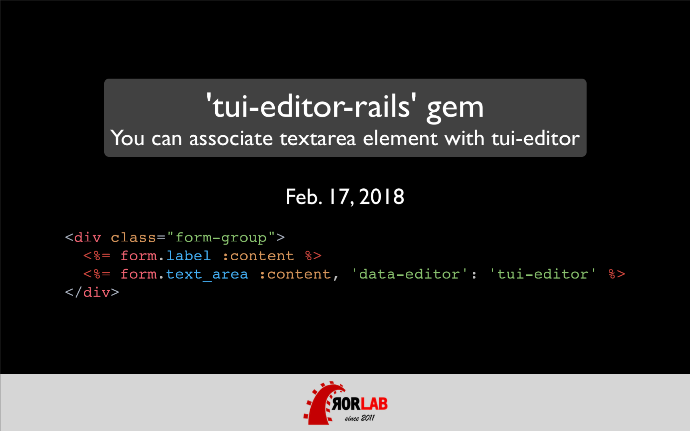

# TuiEditor::Rails

This gem is prepared to simplify the process of installation of tui-editor package.
It includes bower_components directory taken from bower installation of tui-editor.

## Installation

Add this line to your application's Gemfile:

```ruby
gem 'tui_editor-rails'
```

And then execute:

    $ bundle

Or install it yourself as:

    $ gem install tui_editor-rails

## Usage

1. application.js

```js
//= require jquery/dist/jquery
//= require tui-code-snippet/dist/tui-code-snippet
//= require markdown-it/dist/markdown-it
//= require to-mark/dist/to-mark
//= require codemirror/lib/codemirror
//= require highlightjs/highlight.pack
//= require squire-rte/build/squire
```

2. application.scss

```scss
@import 'codemirror/lib/codemirror';
@import 'highlightjs/styles/github';
@import 'tui-editor/dist/tui-editor';
@import 'tui-editor/dist/tui-editor-contents';
```

3. Attach tui-editor to form view

In tui-editor, two classes are included for editor and, more lighter, viewer in accoding to tui-editor docs:
- ToastUIEditor
- ToastUIEditorViewer

But, you should not require editor and viewer classes synchronously for tui-editor; editor or viewer class per one webpage.
That is important. 

So, codes to implement tui-editor in rails project are not only verbose but also smells monkey. But with my poor javascript coding tech, it works well in assocation with form-associated tag element(textarea).

First of all, I needed a controller-specific namespacing for javascript codes to prevent javascript errors in other web pages not including tui-editor. In layout template, I added class style to body tag as follows:

```html
<body class="<%= controller_name %> <%= action_name %>">
```

Next, I added at the top of `_form.html.erb` partial to use tui editor as follows:

```html
<script src="/assets/tui-editor/dist/tui-editor-Editor.min"></script>
<script src="/assets/tui-editor/dist/tui-editor-extScrollSync.min"></script>
```

And, I added at the top of `show.html.erb` view template to use tui viewer as follows:

```html
<script src="/assets/tui-editor/dist/tui-editor-Viewer.min"></script>
```

To implement javascript codes in the special scope, I needed additional javascript codes. That is 
[ORGANIZING JAVASCRIPT IN RAILS APPLICATION WITH TURBOLINKS](http://brandonhilkert.com/blog/organizing-javascript-in-rails-application-with-turbolinks/)

To implement this logic, I referred to this blog post and finally wrote codes as follows:

```coffeescript
$(document).on "turbolinks:load", ->
  return unless $(".home.index, .posts.new, .posts.edit").length > 0
  tui_editor = new App.TuiEditor $("[data-editor='tui-editor']")
  tui_editor.render()
  tui_editor.form.submit (event) ->
    tui_editor.el.text $("##{tui_editor.el[0].id}-editor").tuiEditor 'getValue'  
$(document).on "turbolinks:load", ->
  return unless $(".posts.show").length > 0
  tui_viewer = new App.TuiViewer $("[data-viewer='tui-viewer']")
  tui_viewer.render()  
```

In this code snippets, specific class selecting is critically important as follows:

```coffeescript
•••
return unless $(".home.index, .posts.new, .posts.edit").length > 0
•••
```

That is, we can scope javascript implementation to specific controllers and, more over, to specific actions.

So I needed two more classes for editor and viewer.

in **app.tui_editor.coffee**:

```coffeescript
class App.TuiEditor
  constructor: (@el) ->
    @el.hide().after "<div id='#{@el[0].id}-editor'></div>"
    @form = @el.closest('form')
    # console.log @form

  render: ->
    $("##{@el[0].id}-editor").tuiEditor
      initialEditType: 'markdown'
      initialValue: @el.text()
      viewer: false
      previewStyle: 'vertical'
      height: 500,       
      exts: ['scrollSync'] 
```

in **app.tui_viewer.coffee**:

```coffeescript
class App.TuiViewer
  constructor: (@el) ->
    @el.hide().after "<div id='#{@el[0].id}-viewer'></div>"

  render: ->
    $("##{@el[0].id}-viewer").tuiEditor
      viewer: true
      initialValue: @el.text()
      height: 500
```

Finally, I needed a global scope to implement javascript codes in all pages.

```coffeescript
window.App ||= {}

App.init = ->
  # you can write code to implement in all pages.

$(document).on "turbolinks:load", ->
  App.init()
```

Yeah, it's time to wake up my browser.

Oh, just a moment. I forgot to comment additionally.
You can also add tui-editor to div tag without form element as follows:

```html
<div data-editor='tui-editor'></div>
```

If you insert this code in home#index page, don't forget to add `.home.index` class as follows:

```coffeescript
$(document).on "turbolinks:load", ->
  return unless $(".home.index, .posts.new, .posts.edit").length > 0
  tui_editor = new App.TuiEditor $("[data-editor='tui-editor']")
  tui_editor.render()
  tui_editor.form.submit (event) ->
    tui_editor.el.text $("##{tui_editor.el[0].id}-editor").tuiEditor 'getValue'  
```  


Youtube screencast:

[](https://youtu.be/C16dX3lwBjA)


## Development

After checking out the repo, run `bin/setup` to install dependencies. You can also run `bin/console` for an interactive prompt that will allow you to experiment.

To install this gem onto your local machine, run `bundle exec rake install`. To release a new version, update the version number in `version.rb`, and then run `bundle exec rake release`, which will create a git tag for the version, push git commits and tags, and push the `.gem` file to [rubygems.org](https://rubygems.org).

## Contributing

Bug reports and pull requests are welcome on GitHub at https://github.com/luciuschoi/tui_editor-rails.
