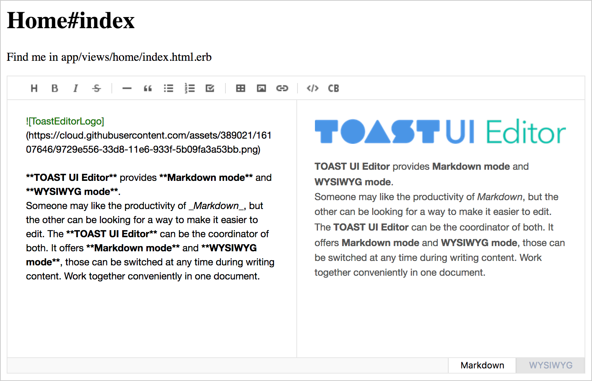

# TuiEditor::Rails

This gem is prepared to simplify the process of installation of tui-editor package.
It includes bower_components directory taken from bower installation of tui-editor.

## Installation

Add this line to your application's Gemfile:

```ruby
gem 'tui_editor-rails'
```

And then execute:

    $ bundle

Or install it yourself as:

    $ gem install tui_editor-rails

## Usage

1. application.js

```js
//= require jquery/dist/jquery
//= require tui-code-snippet/dist/tui-code-snippet
//= require markdown-it/dist/markdown-it
//= require to-mark/dist/to-mark
//= require codemirror/lib/codemirror
//= require highlightjs/highlight.pack
//= require squire-rte/build/squire
//= require tui-editor/dist/tui-editor-Editor.min
```

2. application.scss

```scss
@import 'codemirror/lib/codemirror';
@import 'highlightjs/styles/github';
@import 'tui-editor/dist/tui-editor';
@import 'tui-editor/dist/tui-editor-contents';
```

3. view template file:

```html
<div id="editSection"></div>
<script>
    $('#editSection').tuiEditor({
        initialEditType: 'markdown',
        previewStyle: 'vertical',
        height: 400
    });
</script>
```



## Development

After checking out the repo, run `bin/setup` to install dependencies. You can also run `bin/console` for an interactive prompt that will allow you to experiment.

To install this gem onto your local machine, run `bundle exec rake install`. To release a new version, update the version number in `version.rb`, and then run `bundle exec rake release`, which will create a git tag for the version, push git commits and tags, and push the `.gem` file to [rubygems.org](https://rubygems.org).

## Contributing

Bug reports and pull requests are welcome on GitHub at https://github.com/luciuschoi/tui_editor-rails.
